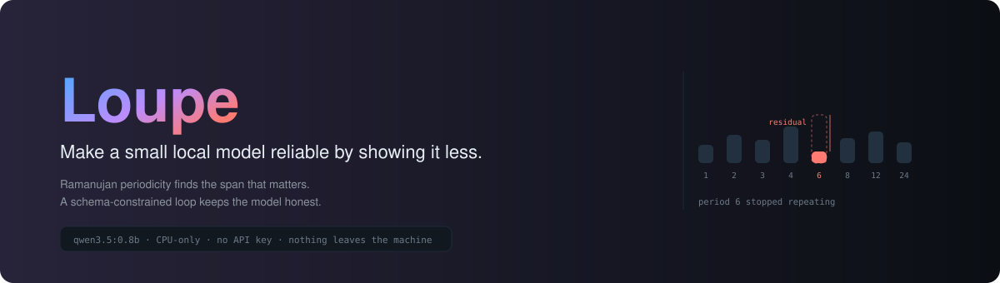
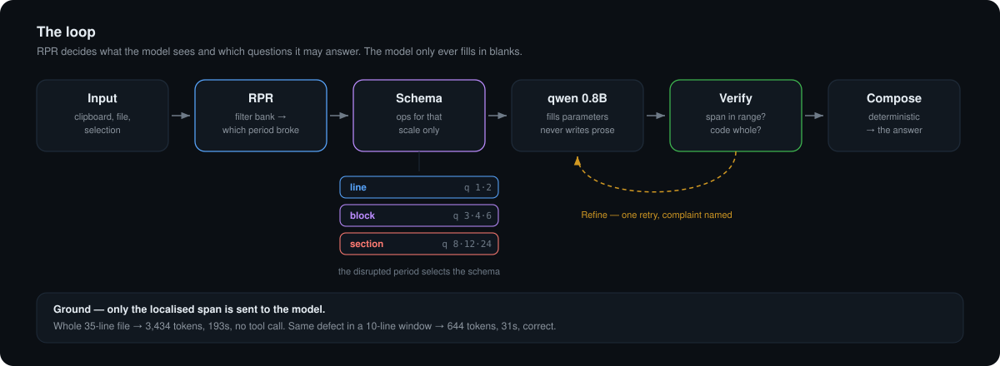
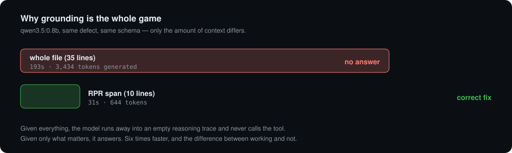
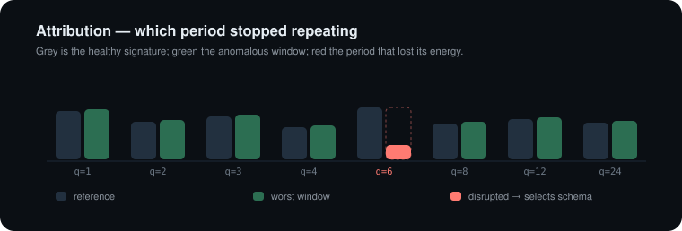

<p align="center">
  
</p>

<p align="center">
  
  
  
  
  
</p>

<p align="center">
  <b>A 0.8B model that could not hold a function together now rewrites one correctly — on a 2018 Intel CPU.</b><br>
  <i>Nothing was fine-tuned. The weights are the stock Apache-2.0 Qwen pull. What changed is what the model is shown, and what it is allowed to say.</i>
</p>

---

## The problem, stated honestly

Ask a small local model to fix a bug and it hands you this:

```python
return 0 if not xs else sum(xs) / len(xs)
```

A bare fragment. The function header is gone, so you cannot paste it anywhere. Tell
it "return the complete code, never a fragment" and it does the same thing again.
Move to the chat endpoint with a firm system prompt and it gets *worse* — pure prose,
no code at all.

The instinct is to reach for a bigger model. On a CPU-only machine that costs ~5 tok/s
and a 30-second wait. The better move is to stop asking a small model to do the thing
it is bad at.

**Small models are unreliable authors and reliable form-fillers.** Loupe is built
entirely on that one observation.

---

## How it works

<p align="center"></p>

Two ideas, composed:

**RPR** — a Ramanujan filter bank over the structure of your text. Not "does this look
wrong?" but *"does this still repeat the way it should?"* Code is strongly periodic:
indent rhythm, repeated block shapes. When something breaks, exactly one period in the
spectrum loses its energy, and that tells you both **where** the defect is and **how
big** it is.

**PGVR** — Parameterize → Ground → Verify → Refine. The model never writes the answer.
It fills a JSON schema, the schema is checked against the real input, and the output is
assembled deterministically here.

RPR is what joins them: the disrupted period picks which schema the model gets. A
broken 2-line cadence is not asked the same questions as a broken 24-line one.

---

## The measurement that justifies all of it

<p align="center"></p>

Same model, same defect, same schema. The only difference is how much context it saw.

| | tokens generated | wall | result |
|---|---|---|---|
| whole file (35 lines) | 3,434 | **193s** | ❌ no tool call at all |
| RPR span (10 lines) | 644 | **31s** | ✅ correct fix |

Given everything, the model runs away into an empty reasoning trace and never calls the
tool. Given only the span that matters, it answers. This is not a 6× speedup — it is
the difference between working and not working.

---

## Attribution: which period broke

<p align="center"></p>

Candidate periods are the highly composite set `{1,2,3,4,6,8,12,24}` — the same trick
the original [RPR](https://github.com/infinitule/RPR) uses to cut a 32-period sweep to
8 without losing divisor coverage.

The filter for period *q* is built from the Ramanujan sum

```
c_q(n) = Σ  cos(2πkn/q)      over k ≤ q with gcd(k,q) = 1
```

which is real, integer-valued, and — the property everything rests on — selective for
*exactly* period q, not its harmonics or its neighbours.

Windows are signatured, scored against the median window by cosine distance, and the
period with the largest fractional energy loss in the worst window is the one that
broke. It is then promoted to the coarsest member of its divisor family that still
carries structure, so a mangled 6-line block reports as **period 6, block scale**
rather than period 2.

---

## Install

Requires [Ollama](https://ollama.com) running locally.

```bash
ollama pull qwen3.5:0.8b
git clone https://github.com/infinitule/loupe && cd loupe
swift build -c release
```

## Use it from the command line

```bash
printf 'def avg(xs):\n    return sum(xs) / len(xs)' | .build/release/loupe fix
```

```
RPR: period-1 line · lines 1–2 · contrast 0.0 · showed model lines 1–2

def avg(xs):
    if not xs:
        return 0
    return sum(xs) / len(xs)
```

The RPR trace goes to stderr, so `loupe fix < in.py > out.py` stays clean.
Tasks: `explain` · `fix` · `refactor` · `tests`.

## Use it as a library

```swift
import Loupe

Loupe.run(.fix, over: source) { result in
    switch result {
    case .success(let answer):
        print(answer.text)              // composed here, not by the model
        print(answer.finding.period)    // which period broke
        print(answer.shownLines)        // what the model was actually shown
    case .failure(let error):
        print(error)                    // unreachable / noToolCall / rejected
    }
}
```

RPR is useful on its own, with no model involved:

```swift
let f = RPR.analyse(source)
if f.confident { print("structure breaks at lines \(f.start)–\(f.end)") }
```

---

## What we learned the hard way

Every row cost a real debugging cycle. Measured on `qwen3.5:0.8b`, macOS 15.7.7,
Intel i9.

| Finding | Detail |
|---|---|
| **`think:false` silently kills tool-calling** | The model emits ~80 tokens that Ollama discards — empty content, no tool call, no error. The free-form path wants thinking off; tool-calling needs it **on**. `think:"low"`/`"medium"` are accepted and ignored. |
| **Context is the bottleneck, not parameters** | 3,434 tokens of reasoning on a whole file vs 644 on a span. Shrinking the input beats shrinking the model. |
| **Verify is load-bearing** | Two of three raw tool calls were unusable: a span of lines 2–14 for a 2-line input, and a `replacement` that was a broken one-liner. |
| **Never fail on metadata** | `line` comes back as `"1: def avg(xs):"` — the line *text*, not its number. Discarding a correct answer over that is the wrong trade when RPR already localised the span. Parse leniently, fall back to RPR. |
| **Field names do the work** | Renaming `what` → `summary` and adding a worked example stopped the model echoing the instruction back as its answer. |
| **Filters need unit L2 norm** | `Σ c_q(n)² = q·φ(q)`, so a `√φ(q)`-scaled filter still has squared norm *q* — longer periods win by having more taps. Under that scaling a period-8 grid reported as period 12. |
| **Correlation must be circular** | A linear sliding correlation leaves `W−q+1` positions, not a whole number of cycles, so energy depends on where the window started. A perfectly clean grid then scores as anomalous as a deliberately broken one. |
| **Contrast, not absolute distance** | On real text every window shares most of its structure, so even a blatant break scores ~0.01 cosine distance. Judge the worst window against the median, not against zero. |

---

## Tests

```bash
swift test
```

The maths is validated the way the original RPR project validates it — identities in
isolation, then synthetic defect injection:

- **Ramanujan identities** — `c_q(0) = φ(q)`, integer-valued, period *q*, and zero sum over one period for *q > 1*
- **Period selectivity** — a pure period-*q* wave must peak on *q* or its divisor family, never on an unrelated coprime period
- **Synthetic injection** — a clean period-8 grid scores residual `0.0000`; the same grid with lines 31–38 flattened scores `0.0456` and is localised correctly
- **Real-world shape** — six 5-line functions with one mangled block resolves to period 6, block scale
- **Degenerate inputs** — empty, one line, blank lines

---

## Credits

- **[RPR](https://github.com/infinitule/RPR)** — Ramanujan Periodicity Residual, the anomaly-detection method this ports from 2-D texture to 1-D text structure.
- **[local-weather-agent-pgvr](https://github.com/infinitule/local-weather-agent-pgvr)** — where the PGVR loop came from, and the origin of the insight that a small thinking model must be used as a tool-caller rather than an author.
- **[Qwen](https://github.com/QwenLM)** (Apache 2.0) — the model. Unmodified; Loupe never redistributes weights.
- Ramanujan sums, S. Ramanujan, 1918.

## License

MIT — see [LICENSE](LICENSE).
