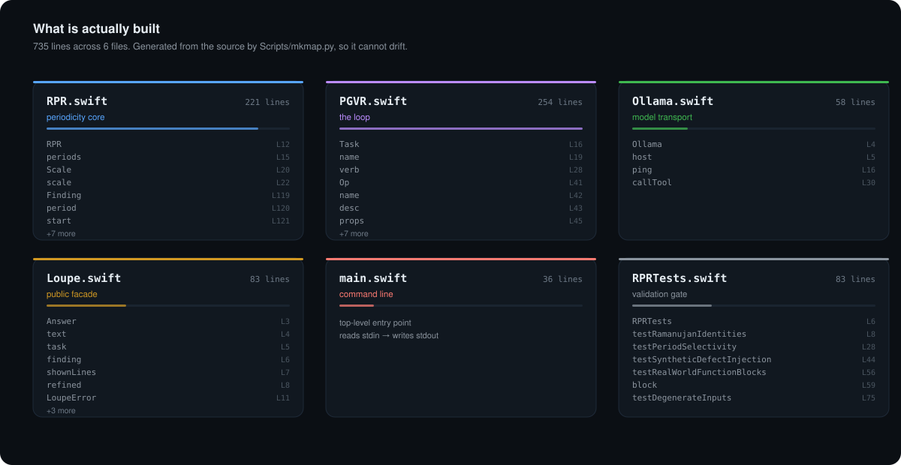

# Architecture

> Generated by `Scripts/mkmap.py` from the source. Do not edit by hand — run the script instead, and it will always match the code.

<p align="center"></p>

## Files

| file | role | lines | public symbols |
|---|---|---:|---:|
| [`Sources/Loupe/Loupe.swift`](../Sources/Loupe/Loupe.swift) | public facade | 83 | 10 |
| [`Sources/Loupe/Ollama.swift`](../Sources/Loupe/Ollama.swift) | model transport | 58 | 4 |
| [`Sources/Loupe/PGVR.swift`](../Sources/Loupe/PGVR.swift) | the loop | 254 | 14 |
| [`Sources/Loupe/RPR.swift`](../Sources/Loupe/RPR.swift) | periodicity core | 221 | 14 |
| [`Sources/LoupeCLI/main.swift`](../Sources/LoupeCLI/main.swift) | command line | 36 | 0 |
| [`Tests/LoupeTests/RPRTests.swift`](../Tests/LoupeTests/RPRTests.swift) | validation gate | 83 | 0 |

**Total — 735 lines across 6 files, 522 of them code.**

## Public API

### `Loupe.swift` — public facade
*The whole loop, in one call.*

- `Answer` <sub>struct · [L3](../Sources/Loupe/Loupe.swift#L3)</sub>
- `text` <sub>prop · [L4](../Sources/Loupe/Loupe.swift#L4)</sub>
- `task` <sub>prop · [L5](../Sources/Loupe/Loupe.swift#L5)</sub>
- `finding` <sub>prop · [L6](../Sources/Loupe/Loupe.swift#L6)</sub>
- `shownLines` <sub>prop · [L7](../Sources/Loupe/Loupe.swift#L7)</sub>
- `refined` <sub>prop · [L8](../Sources/Loupe/Loupe.swift#L8)</sub>
- `LoupeError` <sub>enum · [L11](../Sources/Loupe/Loupe.swift#L11)</sub>
- `description` <sub>prop · [L16](../Sources/Loupe/Loupe.swift#L16)</sub>
- `Loupe` <sub>enum · [L30](../Sources/Loupe/Loupe.swift#L30)</sub>
- `run` <sub>func · [L31](../Sources/Loupe/Loupe.swift#L31)</sub>

### `Ollama.swift` — model transport
*A minimal Ollama client — one schema-constrained tool call, nothing else.*

- `Ollama` <sub>final class · [L4](../Sources/Loupe/Ollama.swift#L4)</sub>
- `host` <sub>prop · [L5](../Sources/Loupe/Ollama.swift#L5)</sub>
- `ping` <sub>func · [L16](../Sources/Loupe/Ollama.swift#L16)</sub>
- `callTool` <sub>func · [L30](../Sources/Loupe/Ollama.swift#L30)</sub>

### `PGVR.swift` — the loop
*PGVR — Parameterize → Ground → Verify → Refine.*

- `Task` <sub>enum · [L16](../Sources/Loupe/PGVR.swift#L16)</sub>
- `name` <sub>prop · [L19](../Sources/Loupe/PGVR.swift#L19)</sub>
- `verb` <sub>prop · [L28](../Sources/Loupe/PGVR.swift#L28)</sub>
- `Op` <sub>struct · [L41](../Sources/Loupe/PGVR.swift#L41)</sub>
- `name` <sub>prop · [L42](../Sources/Loupe/PGVR.swift#L42)</sub>
- `desc` <sub>prop · [L43](../Sources/Loupe/PGVR.swift#L43)</sub>
- `props` <sub>prop · [L45](../Sources/Loupe/PGVR.swift#L45)</sub>
- `schema` <sub>prop · [L50](../Sources/Loupe/PGVR.swift#L50)</sub>
- `op` <sub>func · [L83](../Sources/Loupe/PGVR.swift#L83)</sub>
- `ground` <sub>func · [L125](../Sources/Loupe/PGVR.swift#L125)</sub>
- `normalize` <sub>func · [L145](../Sources/Loupe/PGVR.swift#L145)</sub>
- `verify` <sub>func · [L173](../Sources/Loupe/PGVR.swift#L173)</sub>
- `unfence` <sub>func · [L216](../Sources/Loupe/PGVR.swift#L216)</sub>
- `compose` <sub>func · [L226](../Sources/Loupe/PGVR.swift#L226)</sub>

### `RPR.swift` — periodicity core
*Highly composite candidates — the same trick RPR uses to cut a 32-period*

- `RPR` <sub>enum · [L12](../Sources/Loupe/RPR.swift#L12)</sub>
- `periods` <sub>prop · [L15](../Sources/Loupe/RPR.swift#L15)</sub>
- `Scale` <sub>enum · [L20](../Sources/Loupe/RPR.swift#L20)</sub>
- `scale` <sub>func · [L22](../Sources/Loupe/RPR.swift#L22)</sub>
- `Finding` <sub>struct · [L119](../Sources/Loupe/RPR.swift#L119)</sub>
- `period` <sub>prop · [L120](../Sources/Loupe/RPR.swift#L120)</sub>
- `start` <sub>prop · [L121](../Sources/Loupe/RPR.swift#L121)</sub>
- `end` <sub>prop · [L122](../Sources/Loupe/RPR.swift#L122)</sub>
- `residual` <sub>prop · [L123](../Sources/Loupe/RPR.swift#L123)</sub>
- `contrast` <sub>prop · [L124](../Sources/Loupe/RPR.swift#L124)</sub>
- `spectrum` <sub>prop · [L125](../Sources/Loupe/RPR.swift#L125)</sub>
- `scale` <sub>prop · [L126](../Sources/Loupe/RPR.swift#L126)</sub>
- `confident` <sub>prop · [L132](../Sources/Loupe/RPR.swift#L132)</sub>
- `analyse` <sub>func · [L139](../Sources/Loupe/RPR.swift#L139)</sub>

## Dependencies

```
Loupe.swift      → Ollama.swift
Loupe.swift      → PGVR.swift
Loupe.swift      → RPR.swift
PGVR.swift       → RPR.swift
RPRTests.swift   → Loupe.swift
RPRTests.swift   → RPR.swift
main.swift       → Loupe.swift
main.swift       → PGVR.swift
main.swift       → RPR.swift
```
